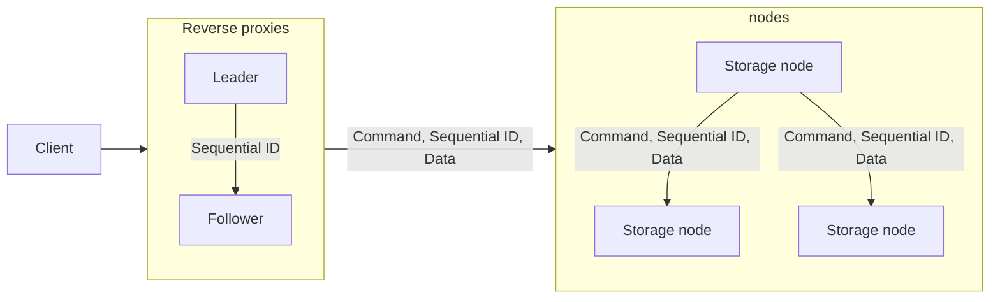

# Distributed file system

#### Erkka Rahikainen, Valtteri Kodisto, Joni Taajamo

## Introduction

The aim of this project is to design and implement a distributed file system that is scalable, reliable and has a strong consistency while maintaining ease of deployment. The chosen architecture follows a Client-Proxy-Nodes model, where the client communicates with a proxy, which in turn interacts with the distributed nodes responsible for storing files. The system emphasizes easy replication of storage nodes to accommodate increased demand and ensure data is not lost in the event of a node failure.

## Architectural overview

### Client

The client initiates requests to the proxy and handles the responses received.

### Reverse proxy

Responsible for handling client requests, the reverse proxy forwards them to the appropriate node. It plays a crucial role in the discovery, load balancing, and sequencing of requests.

### Nodes

Nodes store files, sends changes to other nodes, handle proxy requests, and contribute to the scalability of the system.

## Solution techniques

### Logical clock

Logical clocks are used to maintain the order of operations across the distributed file system. The sequence ID requested from the leader node to ensure consistency among reverse proxies.

### Synchronization

If a node is out of sync, it will be detected when it receives a request with a sequence ID that does not match the latest sequence ID it has stored. After a timeout, the node will then send a synchronization request to another node to get the missing requests. Nodes will store `x` latest requests to be able to synchronize with other nodes.

If the node responding does not have the missing requests, the node that sent the synchronization request will discard its entire database and request a full synchronization from a node.

### Virtualization and Kubernetes

The use of virtualization and Kubernetes facilitates easy deployment, management, and scaling of the distributed file system.

### Redis

Redis is incorporated to enhance system performance, acting as a fast and scalable data store, possibly for caching frequently accessed data.

## Nodes description

### Client

Initiates basic API requests, interacting with the reverse proxy for file operations.

### Reverse Proxy

#### Discovery

Handles the discovery of available nodes to distribute requests effectively.

#### Load Balancing

Ensures even distribution of client requests among available nodes, optimizing system performance.

#### Sequencing

Maintains the order of operations to achieve consistency across the distributed file system.

### File server

Responsible for storing files, sending changes to other nodes, and handling requests from the reverse proxy.

#### Messaging between nodes

## Description of messages sent and received by nodes

### Client - Reverse Proxy

Involves basic API requests from the client, handled by the reverse proxy.

### Reverse Proxy - File Server

Communication via sockets for forwarding client requests to the appropriate file server node.

### File Server - File Server

Socket-based communication for sending changes and ensuring consistency across nodes.

## Features to implement

### Scalability aspects

Enable easy replication of storage nodes to scale the system in response to increased demand.

### Fault tolerance

Implement mechanisms to handle and recover from node failures to ensure system robustness.

### Node discovery

Develop a system for dynamic node discovery, allowing for the addition of new nodes without disrupting operations.

### Synchronization and consistency

Ensure synchronization of file operations and maintain consistency across all distributed nodes.

### Consensus

Implement consensus mechanisms to resolve conflicts and ensure a coherent state among nodes.
